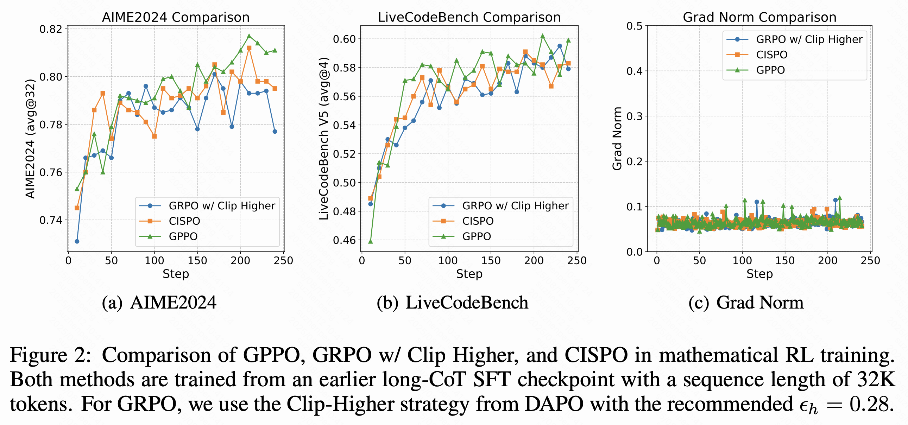

# ✨ Klear-Reasoner: Advancing Reasoning Capability via Gradient-Preserving Clipping Policy Optimization

<div align="center">
    
[](https://arxiv.org/pdf/2508.07629)
[](https://huggingface.co/papers/2508.07629)
[](https://huggingface.co/Kwai-Klear/Klear-Reasoner-8B)
[](https://huggingface.co/datasets/Kwai-Klear/KlearReasoner-MathSub-30K)
[](https://huggingface.co/datasets/Kwai-Klear/KlearReasoner-CodeSub-15K)
[](https://github.com/suu990901/KlearReasoner/issues)
[](mailto:suzhenpeng13@163.com)

</div>

## 📣 Latest News
**[September 26, 2025]** 🔍 We further explored GPPO in depth and proposed **CE-GPPO**, focusing on the impact of ppo-clip tokens on entropy. 📄 The paper is available on [arXiv](https://arxiv.org/pdf/2509.20712) and HuggingFace Daily.
**[August 12, 2025]** 🚀 We released the checkpoint for [KlearReasoner-8B](https://huggingface.co/Kwai-Klear/Klear-Reasoner-8B), along with the training data.
**[August 11, 2025]** 🔬 KlearReasoner-8B conducted preliminary exploration of GPPO.
**[August 11, 2025]** 🏆 We released KlearReasoner-8B, achieving SOTA performance among small-scale 7/8B models.
**[August 11, 2025]** 📢 KlearReasoner is available on [arXiv](https://arxiv.org/pdf/2508.07629) and [HuggingFace Daily](https://huggingface.co/papers/2508.07629).


## 📌 Overview

We present Klear-Reasoner, a model with long reasoning capabilities that demonstrates careful deliberation during problem solving, achieving outstanding performance across multiple benchmarks. We investigate two key issues with current clipping mechanisms in RL: Clipping suppresses critical exploration signals and ignores suboptimal trajectories. To address these challenges, we propose **G**radient-**P**reserving clipping **P**olicy **O**ptimization (**GPPO**) that gently backpropagates gradients from clipped tokens.  


<!-- ## 🚀 Quick Links
| Resource | Link |
|---|---|
| 📝 Preprints | [Paper](https://arxiv.org/pdf/2508.07629) |
| 🤗 Model Hub | [Klear-Reasoner-8B](https://huggingface.co/klear-team/klear-reasoner-8b-SFT) |
| 🤗 Model Hub | [Klear-Reasoner-8B](https://huggingface.co/klear-team/klear-reasoner-8b) |
| 🤗 Dataset Hub | [Math RL](https://huggingface.co/datasets/Suu/KlearReasoner-MathSub-30K) |
| 🤗 Dataset Hub | [Code RL](https://huggingface.co/datasets/Suu/KlearReasoner-CodeSub-Rllm-Cleaned) |
| 📄 Technical Report | [arXiv:250x.xxxxx](https://arxiv.org/abs/250x.xxxxx) |
| 🐛 Issues & Discussions | [GitHub Issues](https://github.com/klear-team/klear-reasoner/issues) |
| 📧 Contact | klear-reasoner@kuaishou.com |

--- -->


<div align="center">


<sub>Benchmark accuracy of Klear-Reasoner-8B on AIME 2024/2025 (avg@64), LiveCodeBench V5 (2024/08/01-2025/02/01, avg@8), and v6 (2025/02/01-2025/05/01, avg@8).</sub>
</div>

Klear-Reasoner is an 8-billion-parameter reasoning model that achieves **SOTA** performance on challenging **math and coding benchmarks**:

| Benchmark | AIME 2024 | AIME 2025 | LiveCodeBench V5 | LiveCodeBench V6 |
|---|---|---|---|---|
| **Score** | **90.5 %** | **83.2 %** | **66.0 %** | **58.1 %** |

The model combines:
1. **Quality-centric long CoT SFT** – distilled from DeepSeek-R1-0528.
2. **Gradient-Preserving Clipping Policy Optimization (GPPO)** – a novel RL method that **keeps gradients from clipped tokens** to boost exploration & convergence.

---

<!-- ## 🛠️ Installation & Usage

### 1. Install Dependencies
```bash
pip install -e .
pip install -r ments.txt
``` -->

<!-- ### 2. Load Model & Generate
```python
from transformers import AutoTokenizer, AutoModelForCausalLM
import torch

model_name = "klear-team/klear-reasoner-8b"
tokenizer = AutoTokenizer.from_pretrained(model_name)
model = AutoModelForCausalLM.from_pretrained(
    model_name,
    torch_dtype=torch.bfloat16,
    device_map="auto"
)

prompt = "Prove that for all positive integers n, n^3 + 2n is divisible by 3."
messages = [{"role": "user", "content": prompt}]
inputs = tokenizer.apply_chat_template(messages, return_tensors="pt").to(model.device)

outputs = model.generate(
    inputs,
    max_new_tokens=8192,
    temperature=0.6,
    top_p=0.95,
    do_sample=True
)
print(tokenizer.decode(outputs[0], skip_special_tokens=True))
```

--- -->


## 📐 GPPO (Gradient-Preserving Clipping Policy Optimization)

GPPO is a **plug-and-play** replacement for PPO/GRPO that keeps the clipped tokens **in the computational graph** and lets their gradients flow in a **bounded, controlled** way.


### Problem with Vanilla Clipping  
Classic importance-ratio clipping (PPO/GRPO) drops all tokens whose ratio  
$r_t^{(j)}=\pi_\theta/\pi_{\text{old}}$ falls outside $[1-\varepsilon_l,\ 1+\varepsilon_h]$.  
Two side-effects appear:

- **High-entropy exploratory tokens** (large $r$, positive advantage) are killed → less exploration.  
- **Negative trajectories** (small $r$, negative advantage) are ignored → slower correction.


### GPPO

Let  
- $\delta = r_t^{(j)}(\theta)=\pi_\theta/\pi_{\text{old}}$ (importance ratio)  
- $\tilde A^{(j)}$ = group-relative advantage  
- $\text{sg}(\cdot)$ = stop-gradient (detach from back-prop)

The **GPPO objective** is  


- **Forward**: behaves exactly like Clip-Higher.  
- **Backward**: the fraction $\frac{1\pm\varepsilon}{\text{sg}(\delta)}$ keeps the clipped magnitude **but still propagates** a mild gradient.


### Gradient Expression  

Let $\phi_\theta(a_{j,t},s_{j,t})$ be the policy-gradient vector.  
The **per-token gradient** is  


where  


- **Never zero** → every token contributes to learning.


### General Form with Tunable Scaling ($\beta_1$, $\beta_2$)  

For finer-grained control:  


Empirically we set $\beta_1 = \beta_2 = 1$.

### Implementation of GPPO
The loss of GPPO only requires modifying **one line of code** based on the PPO/GPPO loss:

*-advantages * torch.clamp(ratio, (1 - cliprange_low) / **ratio.detach() * ratio**, (1 + cliprange_high) / **ratio.detach() * ratio**)*

The complete loss implementation is as follows:
```python
def compute_gppo_loss(
    old_log_prob,
    log_prob,
    advantages,
    response_mask,
    cliprange=None,
    cliprange_low=None,
    cliprange_high=None,
    clip_ratio_c=3.0,
    loss_agg_mode="token-mean",
):
    """Adapted from https://github.com/huggingface/trl/blob/main/trl/trainer/ppo_trainer.py#L1122
    Args:
        old_log_prob: `(torch.Tensor)`
            shape: (bs, response_length)
        log_prob: `(torch.Tensor)`
            shape: (bs, response_length)
        advantages: `(torch.Tensor)`
            shape: (bs, response_length)
        response_mask: `(torch.Tensor)`
            shape: (bs, response_length)
        cliprange: (float)
            The clip range used in PPO. See https://arxiv.org/abs/1707.06347
        cliprange_low: (float)
            The lower clip range used in PPO.
        cliprange_high: (float)
            The higher clip range used in PPO.
        clip_ratio_c: (float) default: 3.0
            The lower bound of the ratio for dual-clip PPO, See https://arxiv.org/pdf/1912.09729
        loss_agg_mode: (str) choices: "token-mean" /
                                      "seq-mean-token-sum" /
                                      "seq-mean-token-mean" /
                                      "seq-mean-token-sum-norm" /
            "token-mean" is the default behavior

    Returns:
        pg_loss: `a scalar torch.Tensor`
            policy gradient loss computed via PPO
        pg_clipfrac: (float)
            the fraction of policy gradient loss being clipped
        ppo_kl: (float)
            the estimated KL divergence between the latest updating policy and the old sampling policy
        pg_clipfrac_lower: (float)
            the fraction of policy gradient loss being clipped when the advantage is negative
    """
    assert clip_ratio_c > 1.0, (
        "The lower bound of the clip_ratio_c for dual-clip PPO should be greater than 1.0,"
        + f" but get the value: {clip_ratio_c}."
    )

    negative_approx_kl = log_prob - old_log_prob
    ratio = torch.exp(negative_approx_kl)
    ppo_kl = verl_F.masked_mean(-negative_approx_kl, response_mask)

    pg_losses1 = -advantages * ratio
    if cliprange_low is None:
        cliprange_low = cliprange
    if cliprange_high is None:
        cliprange_high = cliprange
    pg_losses2 = -advantages * torch.clamp(
        ratio, (1 - cliprange_low) / ratio.detach() * ratio, (1 + cliprange_high) / ratio.detach() * ratio
    )  
    clip_pg_losses1 = torch.maximum(
        pg_losses1, pg_losses2
    ) 
    pg_clipfrac = verl_F.masked_mean(torch.gt(pg_losses2, pg_losses1).float(), response_mask)

    pg_losses3 = -advantages * clip_ratio_c

    clip_pg_losses2 = torch.min(pg_losses3, clip_pg_losses1)
    pg_clipfrac_lower = verl_F.masked_mean(
        torch.gt(clip_pg_losses1, pg_losses3) * (advantages < 0).float(), response_mask
    )

    pg_losses = torch.where(advantages < 0, clip_pg_losses2, clip_pg_losses1)
    pg_loss = agg_loss(loss_mat=pg_losses, loss_mask=response_mask, loss_agg_mode=loss_agg_mode)

    return pg_loss, pg_clipfrac, ppo_kl, pg_clipfrac_lower

```

### Experiment
<div align="center">


<sub>Comparison of GPPO, GRPO w/ Clip Higher, and CISPO in mathematical RL training. Both methods are trained from an earlier long-CoT SFT checkpoint with a sequence length of 32K tokens. For GRPO, we use the Clip-Higher strategy from DAPO with the recommended $$\epsilon_h = 0.28$$.</sub>
</div>

---

## 📊 Benchmark Results (Pass@1)

| Model | AIME2024<br>avg@64 | AIME2025<br>avg@64 | HMMT2025<br>avg@64 | LCB V5<br>avg@8 | LCB V6<br>avg@8 |
|-------|--------------------|--------------------|--------------------|-----------------|-----------------|
| AReal-boba-RL-7B | 61.9 | 48.3 | 29.4 | 34.3 | 31.0† |
| MiMo-7B-RL | 68.2 | 55.4 | 35.7 | 57.8 | 49.3 |
| Skywork-OR1-7B | 70.2 | 54.6 | 35.7 | 47.6 | 42.7 |
| AceReason-Nemotron-1.1-7B | 72.6 | 64.8 | 42.9 | 57.2 | 52.1 |
| POLARIS-4B-Preview  | 81.2 | _79.4_ | 58.7 | 58.5† | 53.0† |
| Qwen3-8B | 76.0 | 67.3 | 44.7† | 57.5 | 48.4† |
| Deepseek-R1-0528-Distill-8B  | _86.0_ | 76.3 | 61.5 | 61.0† | 51.6† |
| OpenReasoning-Nemotron-7B  | 84.7 | 78.2 | 63.5 | _65.6_† | _56.3_† |
| Klear-Reasoner-8B-SFT | 75.6 | 70.1 | 57.6 | 58.5 | 49.6 |
| Klear-Reasoner-8B | 83.2 | 75.6 | 60.3 | 61.6 | 53.1 |
| *w/ 64K Inference Budget*  | **90.5** | **83.2** | **70.8** | **66.0** | **58.1** |

> We report the average `pass@1` results (avg@_n_), with all other evaluation metrics following the DeepSeek-R1 assessment framework (temperature=0.6, top_p=0.95).  


---

## 🧪 Training
### Configure the experimental environment
```bash
git clone https://github.com/suu990901/Klear_Reasoner
cd Klear_Reasoner
pip install -e .
pip install -r requirements.txt
```
For the code, we use [Firejail](https://github.com/netblue30/firejail) for the **sandbox** environment. Additionally, we implemented multi-process control based on [Pebble](https://github.com/noxdafox/pebble), enabling automatic resource reclamation upon task timeout. For mathematics, we use [math_verify](https://github.com/huggingface/Math-Verify) for judging.

### Training Data Format
Please refer to the format of the two provided datasets, [Math RL](https://huggingface.co/datasets/Suu/KlearReasoner-MathSub-30K) and [Code RL](https://huggingface.co/datasets/Suu/KlearReasoner-CodeSub-15K), for the training data. The format for a single math entry is as follows:  
```json
{"data_source": "math_longcot_math_verify", "prompt": [{"content": "Let $n=9867$. If you calculated $n^{3}-n^{2}$, what would be the unit digit found?\n(a) 0\n(b) 2\n(c) 4\n(d) 6\n(e) 8", "role": "user"}], "ability": "math", "reward_model": {"ground_truth": "4", "style": "rule"}, "__index_level_0__": "29999"}  
```
  
Here, the data_source field is set to "math_longcot_math_verify".  

The format for a single code entry is as follows:  
```json
{"hash": "47c43857280be8a7557cc36b998b3012", "ability": "code", "data_source": "coder1_longcot", "prompt": [{"content": "You are an expert Python programmer. You will be given a question (problem specification) and will generate a correct Python program that matches the specification and passes all tests.\n\nTakahashi is planning to eat N dishes.\nThe i-th dish he plans to eat is sweet if S_i = sweet, and salty if S_i = salty.\nIf he eats two sweet dishes consecutively, he will feel sick and be unable to eat any more dishes.\nDetermine whether he can eat all the dishes...", "role": "user"}], "reward_model": {"ground_truth": "...", "style": "rule"}}  
```

Here, the data_source field is set to "coder1_longcot".

**The data_source field affects the choice of verifier.**

### Using Ray for Multi-Node Training
For multi-node training​​, ensure ​​all nodes are started and connected via Ray​​ before executing the training script. Below is a brief setup guide for Ray across multiple machines:
#### Step 1: Start Ray on the Head Node (node0)

On the first node (typically called `node0`), run:

```bash
ray start --head --dashboard-host=0.0.0.0
```

Get the IP address of the master node.
```bash
MASTER_IP=$(hostname -I | awk '{print $1}')
```
#### Step 2: Connect Other Nodes (e.g., node1)

On each additional worker node (e.g., `node1`), run the following, replacing the IP with that of your head node:

```bash
ray start --address=\"$MASTER_IP:6379\"
```

### RL Training
Run the following script on the master node to start the training task.


```bash
bash recipe/dapo/perf_run_dapo_ours_math.sh # For Math RL
bash recipe/dapo/perf_run_dapo_ours_code.sh # For Code RL
```

In the startup script, you need to set the following variables:
```bash
YOUR_MODEL_PATH="<your_model_path>"
CKPTS_SAVE_DIR="<ckpts_save_path>"
YOUR_TRAIN_FILE="<train_data_path>"
YOUR_TEST_FILE="<test_data_path>"
```

It is worth noting that for training stability, if you train with a sequence length shorter than 32K, we recommend enabling **actor_rollout_ref.actor.overlong_filter=True**, as this filters out samples in the rollout that exceed the maximum sequence length. 

We observed that when training with a 32K sequence length, the model can still optimize stably even with actor_rollout_ref.actor.overlong_filter=False. However, if the maximum sequence length is reduced to 16K, training becomes highly unstable, regardless of whether GPPO or GRPO is used.

### More Exploration
**Our exploration of GPPO is still ongoing, so stay tuned.**
Although we can maintain stability when using native GPPO training on KlearReasoner-8B, we later discovered in other internal business models that if the gradient on the low side of the PPO clip range is too large, it can restrict exploration and lead to entropy collapse. To address this issue, we propose two solutions:

• General Form of GPPO: Reducing the hyperparameter beta1 can decrease the gradient backpropagated from the low side of the clip range. Based on our preliminary experiments, setting beta1 to 0.25 or 0.5 and beta2 to 1 yields good performance. Example script:
```bash
bash recipe/dapo/perf_run_dapo_ours_math_general_gppo.sh # For Math RL
```

• Retaining only the gradient from the high side of the clip range: This approach significantly alleviates entropy collapse and encourages the model to explore. Example script:
```bash
bash recipe/dapo/perf_run_dapo_ours_math_only_high.sh # For Math RL
```


### Evaluation
When we expand the inference budget to 64K and adopt **the YaRN method with a scaling factor of 2.5**. 

The evaluation data for AIME24, AIME25, and HMMT2025 are available in our GitHub repository under the **benchmarks directory**.
For LiveCodeBench, please download the data from the official website.

You can run the following commands to perform inference and evaluation:  
```bash
git clone https://github.com/suu990901/KlearReasoner  
cd KlearReasoner/benchmarks  
python inference.py --model "<KlearReasoner-8B_path>" --n 64 --dataset_path ./benchmarks/aime24.qs.jsonl  
python judge_math.py "<path_to_inference_results>"
```

---
## 🤝 Citation
If you find this work helpful, please cite our paper:
```bibtex
@article{DBLP:journals/corr/abs-2508-07629,
  author       = {Zhenpeng Su and
                  Leiyu Pan and
                  Xue Bai and
                  Dening Liu and
                  Guanting Dong and
                  Jiaming Huang and
                  Wenping Hu and
                  Fuzheng Zhang and
                  Kun Gai and
                  Guorui Zhou},
  title        = {Klear-Reasoner: Advancing Reasoning Capability via Gradient-Preserving
                  Clipping Policy Optimization},
  journal      = {CoRR},
  volume       = {abs/2508.07629},
  year         = {2025},
  url          = {https://doi.org/10.48550/arXiv.2508.07629},
  doi          = {10.48550/ARXIV.2508.07629},
  eprinttype    = {arXiv},
  eprint       = {2508.07629},
  timestamp    = {Sat, 13 Sep 2025 14:46:27 +0200},
  biburl       = {https://dblp.org/rec/journals/corr/abs-2508-07629.bib},
  bibsource    = {dblp computer science bibliography, https://dblp.org}
}
```


